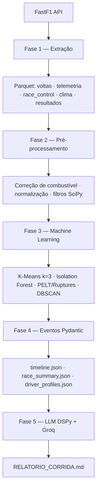

# gridstory

> Pipeline de dados de F1 — da telemetria bruta ao relatório jornalístico em Markdown.


gridstory processa uma corrida de Fórmula 1 e gera automaticamente um relatório jornalístico em português — sem intervenção manual. Basta ter os dados disponíveis no FastF1.

---

## Como funciona



---

## Pré-requisitos

- Python 3.12+
- [uv](https://github.com/astral-sh/uv)
- Chave de API [Groq](https://console.groq.com) (obrigatória para a Fase 5)

---

## Instalação

```bash
git clone https://github.com/seu-usuario/gridstory.git
cd gridstory
uv sync
cp .env.example .env
# Edite .env e adicione sua GROQ_API_KEY
```

---

## Uso

### Interface web (recomendado)

```bash
uv run streamlit run app.py
```

Selecione o ano e a corrida na barra lateral. Se o relatório já existir em disco, é exibido diretamente. Caso contrário, o pipeline roda com feedback visual por fase e o resultado aparece ao final.

### CLI

```bash
# Pipeline completo — extração, ML e relatório
uv run python cli/pipeline.py 2025 1

# Visualizar experimentos de ML no MLflow
uv run mlflow ui
```

---

## Saída

Após o pipeline, os artefatos ficam em `data/timelines/races/YEAR/round_XX/`:

| Arquivo | Descrição |
|---|---|
| `RELATORIO_CORRIDA.md` | Relatório jornalístico em português (salvo também na raiz do projeto) |
| `relatorio.json` | Relatório estruturado validado pelo Pydantic |
| `race_summary.json` | Vencedor, pódio, DNFs, Safety Cars, clima |
| `timeline.json` | Cronologia de eventos: undercuts, abandonos, penalidades, Safety Cars |
| `driver_profiles.json` | Por piloto: compostos usados, clusters de ritmo, anomalias |

Exemplo de saída (`RELATORIO_CORRIDA.md`):

```markdown
# Norris Vence Corrida Eletrizante

> Lando Norris conquistou a vitória em uma corrida marcada por três Safety Cars
> e condições climáticas adversas. Max Verstappen e George Russell completaram o pódio.

A corrida começou com um Safety Car já na primeira volta, após o abandono de Carlos Sainz,
Jack Doohan e Isack Hadjar. Norris manteve a liderança e, na volta 47, consolidou a vitória
com um undercut decisivo sobre Pierre Gasly com margem de 2,4 segundos...
```

---

## Configuração

Todos os parâmetros do pipeline estão em `config.yaml`:

```yaml
llm:
  provider: "groq"
  model: "llama-3.3-70b-versatile"
  max_tokens: 1000

ml:
  degradation:
    penalty: 3                         # sensibilidade do PELT (maior = menos cliffs)
  anomaly:
    adaptive_contamination: true       # estima contaminação com base em SC/flags reais

mlflow:
  enabled: true                        # false para rodar sem tracking
```

---

## Estrutura do projeto

```
gridstory/
├── cli/
│   ├── pipeline.py                    # ponto de entrada principal
│   └── pipeline_steps/                # fases 1–5 (extraction, preprocessing, ml, events, llm)
│
├── src/
│   ├── extraction/                    # FastF1 ETL
│   ├── preprocessing/                 # engenharia de features (SciPy)
│   ├── ml/                            # clustering, anomalias, PELT, undercuts/overcuts
│   ├── llm/                           # NarrativeContext + DSPy reporter
│   ├── models/                        # contratos Pydantic (barreira ML ↔ LLM)
│   └── utils/
│
├── data/                              # gitignored
│   ├── raw/races/
│   ├── processed/races/
│   ├── ml/races/
│   └── timelines/races/
│
├── app.py                             # interface web Streamlit
├── config.yaml                        # todos os hiperparâmetros
├── .env.example                       # variáveis de ambiente necessárias
└── pyproject.toml
```

---

## Stack

| Camada | Ferramentas |
|---|---|
| Extração | FastF1, Pandas, NumPy, PyArrow |
| Pré-processamento | SciPy (signal, interpolate, stats) |
| Machine Learning | scikit-learn, Ruptures |
| Contratos de dados | Pydantic v2 |
| LLM | DSPy, Groq (llama-3.3-70b-versatile) |
| Observabilidade | MLflow |
| Interface web | Streamlit |

---

## Contribuição

Issues e pull requests são bem-vindos. Para mudanças significativas, abra uma issue primeiro para discutir o que você gostaria de alterar.
